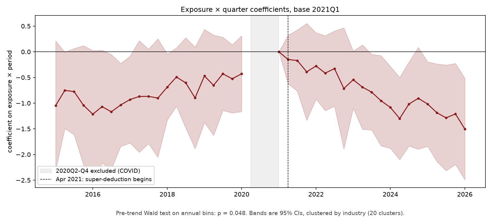

# UK Capital Allowances and Manufacturing Investment

A preregistered difference-in-differences study of whether the 2021 to 2025 capital allowance reforms raised business investment in industries that use more plant and machinery.

**Headline result: no detectable effect, and the design cannot separate the allowance channel from the wider manufacturing decline. Both preregistered decision rules failed.**

---

## The puzzle

Between 2021 and 2025, UK manufacturing business investment fell 20.1% in real terms, from £40.1bn to £32.1bn. Over the same period non-manufacturing business investment rose 21.6%.

This happened during the most generous period of UK capital allowances in decades. The super-deduction gave a 130% write-off on plant and machinery from April 2021. Full expensing replaced it in April 2023 and was made permanent that November. Manufacturers invest roughly twice as much in machinery as the average UK business, so on the standard user cost model they had the most to gain.

An earlier descriptive report of mine concluded that the allowance channel was real in direction but small, and was outweighed by monetary tightening, the 2022 energy shock, Brexit, and the long-run decline in manufacturing's investment share. That decline is substantial in its own right: manufacturing fell from 18.6% of UK business investment in 1997 to 10.3% in 2025. The report's stated limitation was that a descriptive approach cannot isolate the allowance channel using econometric methods.

This project tests it formally.

## What I did

A continuous treatment-intensity difference-in-differences on 20 private-sector industries over 42 quarters, 2015Q1 to 2026Q1, excluding 2020Q2 to 2020Q4.

Treatment intensity is the present value of allowances per £1 of qualifying spend, computed quarter by quarter from the Hall-Jorgenson user cost. Exposure is each industry's share of plant and machinery in its net capital stock, fixed at a 2015 to 2019 baseline. The estimating equation is

```
log(I_it) = α_i + λ_t + β(NPV_t × PM_i) + ε_it
```

with industry and quarter fixed effects and standard errors clustered by industry. Industry fixed effects absorb exposure, quarter fixed effects absorb the allowance regime, so only the interaction is identified.

The specification, sample, decision rules and full robustness list were committed to `PREREGISTRATION.md` and pushed to GitHub before any estimation code existed. The commit history shows this.

## What I found

**β = −0.398, clustered SE 1.017, p = 0.696.**

In interpretable units, the April 2021 reform is associated with investment about 1.1% lower at manufacturing-mean exposure than at non-manufacturing-mean exposure, with a 95% confidence interval running from −6.4% to +4.3%. A wild cluster bootstrap with 9,999 replications gives p = 0.71, so the primary inference confirms the analytic result.

Both preregistered decision rules failed.

**Rule 2, parallel trends.** A Wald test on the pre-treatment leads gives p = 0.048, rejecting parallel trends at 5%. The margin is 0.002, which is worth stating openly rather than reporting as decisive. Under the rule as written, β is not a causal estimate. It is a descriptive association.



The event study shows why. Pre-treatment coefficients drift upward toward the 2021Q1 base, so high-exposure industries were gaining relative ground before the policy started. That is the run-up to 2021 being the highest annual manufacturing investment in the ONS series since 1997, not a flat counterfactual. The design then reads the subsequent decline against that upward path, which is where the negative coefficient comes from. Every individual coefficient's confidence interval contains zero. Only the joint test rejects.

**Rule 1, separability.** Re-estimating on the 13 non-manufacturing industries alone gives β = +0.124 with a standard error of 3.18. The sign flips, which triggers failure under the rule. The standard error is also three times larger, so the subsample cannot pin the sign down either. Both facts point the same way.

**Robustness.** Nine pre-specified specifications. Nothing is significant anywhere, with p ranging from 0.202 to 0.975 and β ranging from −2.07 to +0.13. Substituting gross capital stocks for net flips the sign, even though the two exposure measures correlate at 0.971. Exposure terciles show no dose-response. A `pyfixest` cross-check reproduces the primary estimate to 1e-16.

## What it means

The estimate is indistinguishable from zero under every specification, and its sign is not stable to defensible changes in how exposure is measured. That is not a precise null. It is a coefficient the data cannot pin down.

The reason is visible in the exposure variable. Manufacturing industries span 0.342 to 0.701 on plant and machinery intensity; non-manufacturing spans 0.035 to 0.486. Only agriculture and construction sit inside the manufacturing range. Treatment intensity is therefore close to a manufacturing indicator interacted with timing, which is why removing manufacturing removes most of the identifying variation.

So the conclusion is about identification rather than about tax policy. Industry-level published data cannot separate the allowance channel from the secular decline in UK manufacturing, because exposure and manufacturing status are nearly the same variable. My earlier report asserted that limitation. This project measures it.

Two things support reading the null as substantive rather than merely underpowered. The OBR's November 2023 retrospective concluded that the policy did not appear to boost business investment overall. And 82% of firms in the Bank of England's Decision Maker Panel reported no change to capital expenditure plans after full expensing was made permanent.

Identifying this properly would need firm-level data. HMRC notes that businesses
claiming at least £1 million of capital allowances make up 1% of claimants but
account for around 80% of all capital allowance claimed (HMRC Research Report
782, footnote 1, citing Corporation Tax Statistics 2022). Industry-level exposure
cannot distinguish that 1% from the rest, so the coefficient is at best an
intention-to-treat on industries whose treated share is unobserved.

## A correction to the prior report

The descriptive report claimed engineering and vehicles was the most machinery-intensive manufacturing subsector, and used its comparatively small investment decline as evidence for the allowance channel.

Measured against ONS capital stocks, engineering and vehicles ranks fourth of seven manufacturing subsectors on plant and machinery intensity, and sixth of seven on an investment-flow measure. The rank correlation between exposure and 2021 to 2025 investment change across the seven subsectors is +0.32 on stocks and −0.11 on flows, neither distinguishable from zero at n = 7.

The likely cause is that SIC 26 to 30 manufactures machinery. The prior report read that as an industry that uses machinery intensively, which confuses output composition with capital input composition.

The report's overall conclusion, that the allowance channel was real but small and outweighed by other channels, is unaffected. What does not survive is the subsector ranking as evidence for it. Reporting this was committed to in the preregistration regardless of what the regression found.

## Reproducing

Python 3.13. Note that `linearmodels` does not currently publish wheels for 3.14.

```bash
python -m venv .venv
.venv\Scripts\Activate.ps1          # Windows
pip install -r requirements.txt
```

Run in order:

```bash
python src/build_exposure.py        # exposure from capital stocks
python src/build_exposure_flow.py   # flow-based exposure, robustness item 1
python src/build_treatment.py       # quarterly allowance NPV series
python src/build_panel.py           # 840-row balanced panel
python src/estimate.py              # primary specification
python src/event_study.py           # event study and Rule 2
python src/rule1.py                 # non-manufacturing subsample
python src/bootstrap.py             # wild cluster bootstrap
python src/robustness.py            # full robustness table
```

All three ONS source files are committed in `data/raw/` with their release dates in the filenames, so results reproduce exactly against those vintages.

## Limitations

Industry-level data cannot identify firms above the £1m AIA threshold, where the marginal treatment is concentrated. The coefficient is at best an intention-to-treat on industries whose treated share is unobserved.

The super-deduction and full expensing were available only to companies within
the charge to Corporation Tax (Finance Bill, Resolution 9 Clause 9, Amendment 2,
para 5). ONS business investment covers unincorporated businesses as well, which
were never eligible and could only use the Annual Investment Allowance. The
outcome therefore includes investment that could not respond to the treatment,
and the share of such investment varies by industry.

Parallel trends is rejected, so β is reported as an association and not as a causal effect.

ONS deflators for machinery, transport and ICT are built from import price indices of materials and fuels rather than product price indices, which is a known weakness during the 2022 energy shock.

Industry series in this dataset are seasonally adjusted and then aggregated, whereas the headline ONS Business Investment release adjusts asset-level series first. The panel therefore does not reconcile exactly to the headline release.

The wild cluster bootstrap was applied to β but not to the Rule 2 Wald test, which is a joint test of several restrictions and needs a different procedure.

Rule 2 as originally preregistered was infeasible. With 20 clusters the cluster-robust covariance matrix has rank 18, so a joint test of 21 restrictions is not defined. The test was moved to annual bins. The amendment is recorded in `PREREGISTRATION.md` section 13 and was committed before the amended test was run.

## Repository

```
PREREGISTRATION.md      specification, decision rules, amendments
NOTES.md                working log of decisions and numbers
src/                    analysis scripts, run in the order above
data/raw/               ONS source files, committed with vintage dates
data/processed/         intermediate outputs
output/                 figures and tables
```

## Sources

ONS Business investment by industry and asset, 30 June 2026. ONS Gross and net capital stocks by asset and industry, 27 November 2025. ONS Annual GFCF by industry and asset, 3 November 2025.

Figures here are computed from the 30 June 2026 vintage and differ by up to 0.1 percentage points from the earlier descriptive report, which used an earlier vintage.
